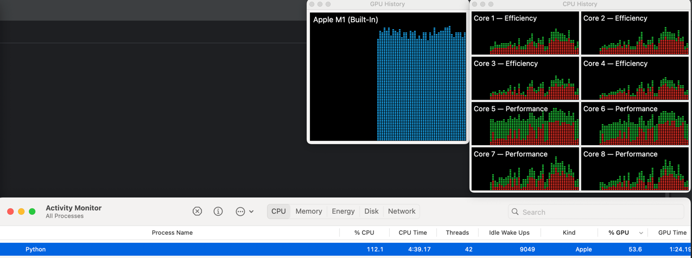

After initial install of just tensorflow, output is:

```json
[name: "/device:CPU:0"
device_type: "CPU"
memory_limit: 268435456
locality {
}
incarnation: 17203847663338291343
xla_global_id: -1
]
```


After installing tensorflow-macos and tensorflow-metal, you can see training running on the GPU:

```bash
/Users/lthompson/code/clarifruit/poc-tensorflow-apple-silicon/.venv/bin/python /Users/lthompson/code/clarifruit/poc-tensorflow-apple-silicon/main.py 
Num GPUs Available:  1
Downloading data from https://www.cs.toronto.edu/~kriz/cifar-100-python.tar.gz
169001437/169001437 ━━━━━━━━━━━━━━━━━━━━ 14s 0us/step
2024-11-11 16:04:25.726710: I metal_plugin/src/device/metal_device.cc:1154] Metal device set to: Apple M1
2024-11-11 16:04:25.726730: I metal_plugin/src/device/metal_device.cc:296] systemMemory: 16.00 GB
2024-11-11 16:04:25.726738: I metal_plugin/src/device/metal_device.cc:313] maxCacheSize: 5.33 GB
2024-11-11 16:04:25.726962: I tensorflow/core/common_runtime/pluggable_device/pluggable_device_factory.cc:305] Could not identify NUMA node of platform GPU ID 0, defaulting to 0. Your kernel may not have been built with NUMA support.
2024-11-11 16:04:25.726973: I tensorflow/core/common_runtime/pluggable_device/pluggable_device_factory.cc:271] Created TensorFlow device (/job:localhost/replica:0/task:0/device:GPU:0 with 0 MB memory) -> physical PluggableDevice (device: 0, name: METAL, pci bus id: <undefined>)
Epoch 1/5
2024-11-11 16:04:32.655457: I tensorflow/core/grappler/optimizers/custom_graph_optimizer_registry.cc:117] Plugin optimizer for device_type GPU is enabled.
194/782 ━━━━━━━━━━━━━━━━━━━━ 6:56 708ms/step - accuracy: 0.0272 - loss: 5.5830
```


